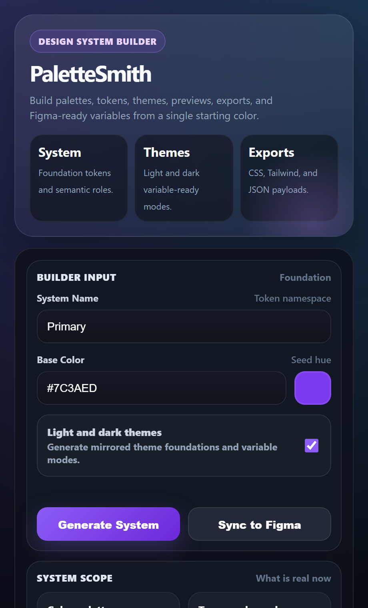

<p align="center">
  
</p>

<h1 align="center">PaletteSmith</h1>

<p align="center">
  <a href="https://www.figma.com/community/plugin/1656891050552747365">
    
  </a>
  
  
  
</p>

<p align="center">
  PaletteSmith turns a single base color into a design-system starter kit with palette ramps, semantic roles, Figma Variables, paint styles, and code exports.
</p>

## Branding

- SVG logo: [`assets/logo.svg`](C:/Users/matth/OneDrive/Desktop/company/PaletteSmith/assets/logo.svg)
- PNG logo: [`assets/logo.png`](C:/Users/matth/OneDrive/Desktop/company/PaletteSmith/assets/logo.png)

## Features

- Generate a base palette and mirrored dark palette
- Build semantic color groups for `accent`, `success`, `warning`, and `danger`
- Create Figma paint styles
- Create Figma Variables collections for colors, typography, spacing, radius, and shadows
- Export CSS variables, Tailwind-ready config scaffolding, and JSON tokens
- Preview theme direction, semantic roles, exports, and accessibility stats in the plugin UI

## Screenshots

Screenshots live in [`assets/screenshots`](C:/Users/matth/OneDrive/Desktop/company/PaletteSmith/assets/screenshots).

### Overview



### Tailwind Export


### CSS Export


## Project Files

- [`manifest.json`](C:/Users/matth/OneDrive/Desktop/company/PaletteSmith/manifest.json): Figma plugin manifest
- [`ui.html`](C:/Users/matth/OneDrive/Desktop/company/PaletteSmith/ui.html): plugin interface
- [`src/code.ts`](C:/Users/matth/OneDrive/Desktop/company/PaletteSmith/src/code.ts): plugin runtime and Figma sync logic
- [`dist/code.js`](C:/Users/matth/OneDrive/Desktop/company/PaletteSmith/dist/code.js): compiled plugin entry

## Local Setup

```bash
npm install
npm run build
```


## Using The Plugin

1. Enter a system name and base HEX color.
2. Click `Generate System`.
3. Review the palette preview, token previews, exports, and accessibility summary.
4. Click `Sync to Figma`.

PaletteSmith currently creates:

- `Brand/...` paint styles
- `Semantic/...` paint styles
- color variables
- semantic alias variables
- typography variables
- spacing variables
- radius variables
- shadow variables


## Current Scope

Implemented now:

- palette generation
- semantic token modeling
- light/dark variable modes
- CSS/Tailwind/JSON export
- Figma Variables sync

Still planned:

- OKLCH-native palette generation
- text styles and effect styles
- SwiftUI / Flutter / Android exports
- richer accessibility fixes
- more component previews

## Reporting Issues

If you find a bug, please open a GitHub issue using the repo's issue templates:

- bug reports: [`.github/ISSUE_TEMPLATE/bug_report.md`](C:/Users/matth/OneDrive/Desktop/company/PaletteSmith/.github/ISSUE_TEMPLATE/bug_report.md)
- feature requests: [`.github/ISSUE_TEMPLATE/feature_request.md`](C:/Users/matth/OneDrive/Desktop/company/PaletteSmith/.github/ISSUE_TEMPLATE/feature_request.md)

For general repo feedback, the standard issue template is also available:

- general issue: [`.github/ISSUE_TEMPLATE/general-issue.md`](C:/Users/matth/OneDrive/Desktop/company/PaletteSmith/.github/ISSUE_TEMPLATE/general-issue.md)

## Security

If you believe you have found a security issue, please do not file a public issue.

Review the disclosure guidance in [SECURITY.md](C:/Users/matth/OneDrive/Desktop/company/PaletteSmith/SECURITY.md:1) and report the issue privately instead.

## Publishing Checklist

- Add support contact
- Add Community listing copy
- Review the plugin metadata in Figma
- Complete the data/security form
- Publish from `Plugins -> Manage plugins` in the Figma desktop app
